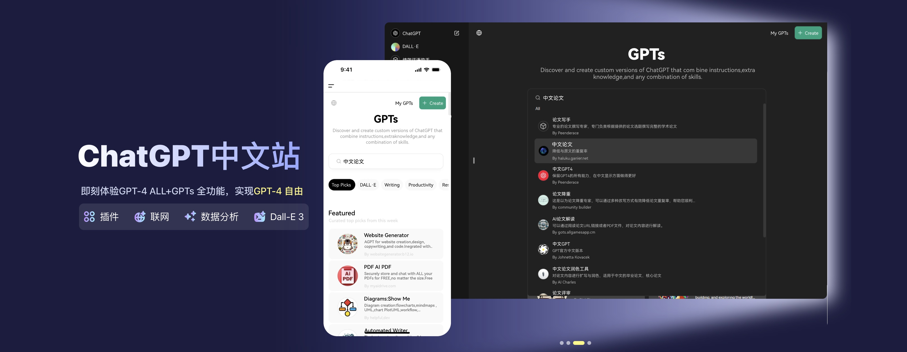
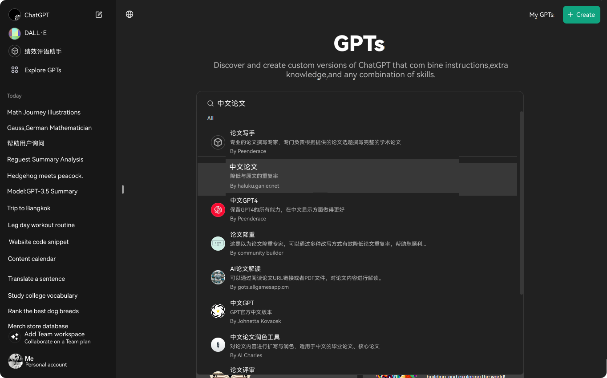
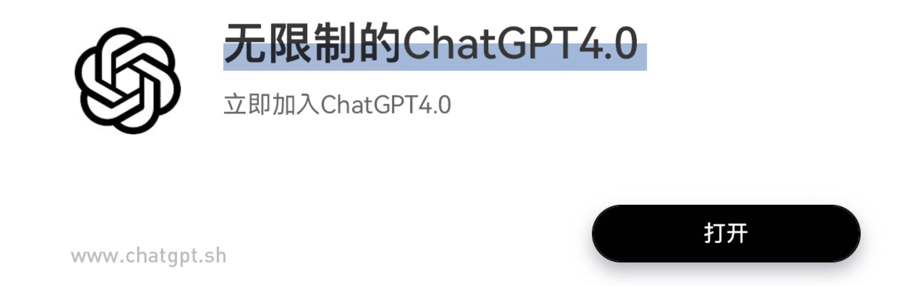

<h1 align="center">ChatGPT (ChatGPT 中文站)</h1>

ChatGPT 中文站的理念是降低ChatGPT的官网使用门槛，帮助更多的用户用上ChatGPT，让AI工具的使用变的更简单、更轻松、更实惠。

[![Web][Web-image]][web-url]
[![Windows][Windows-image]][download-url]
[![MacOS][MacOS-image]][download-url]

[网页版](https://www.chatgpt.sh) / [客户端-开发中ing](https://www.chatgpt.sh)

[web-url]: https://www.chatgpt.sh
[Web-image]: https://img.shields.io/badge/Web-PWA-orange?logo=microsoftedge
[Windows-image]: https://img.shields.io/badge/-Windows-blue?logo=windows
[MacOS-image]: https://img.shields.io/badge/-MacOS-black?logo=apple:

> [!NOTE]
> 本项目已接入阿里云文字风控系统，网站严格禁止用户涉政，请遵守国家的相关管控，违者将永久拉黑IP段，永久禁止使用。
>
> 根据[《生成式人工智能服务管理暂行办法》](http://www.cac.gov.cn/2023-07/13/c_1690898327029107.htm)的要求，为了响应国家互联网信息办公室近期发布的《生成式人工智能服务管理办法》的要求，您在使用本公益站点时，不得生成以下内容。
>
> 1. 违反社会主义核心价值观：不得生成或传播颠覆国家政权、破坏社会主义制度等内容。
> 2. 岐视性内容：禁止生成任何种族、民族、信仰等方面的歧视内容。
> 3. 侵犯知识产权：严禁侵犯他人知识产权和商业秘密。
> 4. 虚假信息：禁止生成虚假信息。
> 5. 损害他人权益：不得生成侵犯他人身心健康肖像权名誉权和个人隐私的内容。

## 主要功能

- 在 1 分钟内快速使用上 ChatGPT **免费且无需注册**
- 官网直达，非套壳产品，使用体验与官网完全一致，用户可以在第一时间体验到官网发布的新功能
- 可在任何地方**无障碍**快速访问，不受地域限制
- 无需为如何订阅ChatGPT PLUS/TEAM 会员而烦恼，我们背后内置了非常多 PLUS/TEAM 账号
- 支持访问和使用GPTs商店，包括搜索GPTs，使用DALL·E-E绘画模型等
- 支持最新GPT-4o模型，支持多模态，如上传PDF、图片分析、AI绘画、联网搜索对话等
- 支持对话隔离，隔离状态下其他人将无法看到你的对话内容，保护隐私
- 数据漫游，数据保存在用户浏览器本地和我们的服务器云端
- 自动压缩上下文聊天记录，在节省 Token 的同时支持超长对话
- 极快的加载速度（~100kb），支持流式响应
- 精心设计的 UI，响应式设计和完善的会员与售后系统
- 无需担心OpenAI的封号风险
- 支持**免注册、免登录**状态下体验网站功能，如体验最新的 GPT4o 模型，GPT3.5 对话等
- 完整的 Markdown 支持：LaTex 公式、Mermaid 流程图、代码高亮等等

## 功能展示

### GPTs 商店

### 联网搜索

### DALL-E 绘画

🔥Tips：DALL-E绘图已支持局部重绘，点击图片后进入局部重绘页面，套索选中图像区域进行二次重绘。

### 数据分析

## 开发计划

- [x] 在每个对话结束后的 10 分钟保存到云端，防止对话记录丢失
- [x] 企业版团队满员时支持购买席位扩容
- [x] 个人积分中心，成功邀请好友开通会员后可以获取积分
- [x] 支持邀请码、图片、链接分享
- [x] 积分中心支持积分提现
- [x] 个人中心支持修改头像和昵称
- [ ] 新增热门 GPTs 页面、完善 loading 状态

## 最新动态

- 🚀 v1.0 已经发布，现在你可以进入 ChatGPT 中文站快速使用 GPT 进行对话了！ 了解更多： [ChatGPT 中文站常见疑问解答](./docs/QA.md)。
- 🚀 v1.1 现在可以支持多种邀请方式了，积分中心可以查看邀请人信息了。

## 快速开始

1. 登录/注册 [ChatGPT中文站](https://www.chatgpt.sh)
2. 点击 【免费/开始】使用ChatGPT
3. Enjoy :)

## FAQ

[简体中文 > 常见问题](./docs/QA.md)

